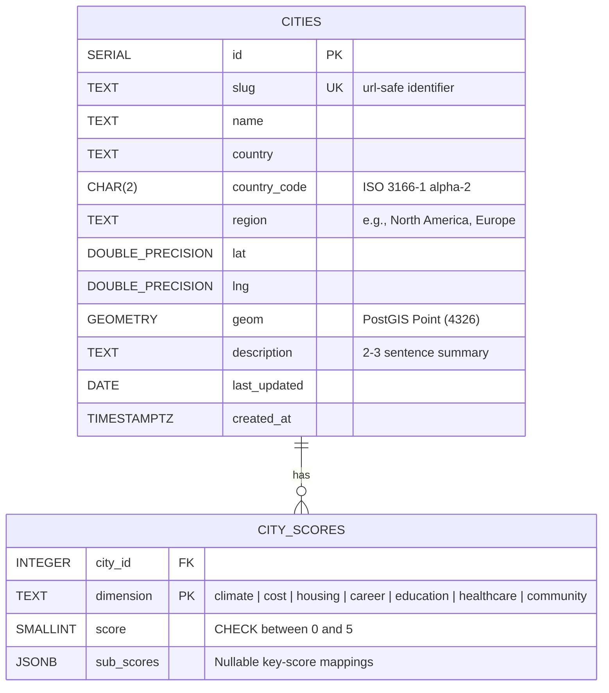

# RelocateWise — Database Design

This document details the database architecture for the RelocateWise Minimum Viable Product (MVP). Under the project constraints (`docs/Constraints.md`), the database runs on PostgreSQL 16 with PostGIS 3.4 extensions, hosted inside a Docker container on the target Ubuntu environment.

---

## 1. Design Principles

1. **Normalized Dimension Scoring**: Rather than flattening scores as columns on the `cities` table, dimension scores are stored in a separate `city_scores` table (one row per city per dimension). This allows adding new metrics (e.g., "Air Quality" or "Tax Index") in the future without modifying the table schema or running database migrations.
2. **Zero-PII Footprint**: In compliance with the GDPR-compliant state requirements defined in the PRD, the database stores **only** global city data. No user sessions, questionnaire profiles, shortlists, or lead captures are persisted.
3. **Seeding from Version-Controlled Source**: The database is designed as a build artifact. The canonical source of truth for the city dataset resides in version control (`db/seeds/cities.json`). Database initialization and recovery re-seed the tables from this file.

---

## 2. Entity Relationship Diagram



---

## 3. Schema DDL Definition

The database schema is initialized by the migration script [001_init.sql](file:///Users/victorxu/projects/relocate_wise/db/migrations/001_init.sql).

```sql
-- Enable PostGIS extensions for future geospatial spatial filtering (e.g., "cities within X miles of coast")
CREATE EXTENSION IF NOT EXISTS postgis;

CREATE TABLE IF NOT EXISTS cities (
  id            SERIAL PRIMARY KEY,
  slug          TEXT UNIQUE NOT NULL,
  name          TEXT NOT NULL,
  country       TEXT NOT NULL,
  country_code  CHAR(2) NOT NULL,
  region        TEXT NOT NULL,
  lat           DOUBLE PRECISION NOT NULL,
  lng           DOUBLE PRECISION NOT NULL,
  geom          GEOMETRY(Point, 4326),
  description   TEXT NOT NULL,
  last_updated  DATE NOT NULL,
  created_at    TIMESTAMPTZ NOT NULL DEFAULT now()
);

CREATE TABLE IF NOT EXISTS city_scores (
  city_id     INTEGER NOT NULL REFERENCES cities(id) ON DELETE CASCADE,
  dimension   TEXT NOT NULL,
  score       SMALLINT NOT NULL CHECK (score BETWEEN 0 AND 5),
  sub_scores  JSONB,
  PRIMARY KEY (city_id, dimension)
);

-- Indices for performance optimization
CREATE INDEX IF NOT EXISTS cities_region_idx          ON cities (region);
CREATE INDEX IF NOT EXISTS cities_country_code_idx   ON cities (country_code);
CREATE INDEX IF NOT EXISTS city_scores_dimension_idx ON city_scores (dimension);
```

### Table: `cities`

Stores the primary metadata and geo-coordinates for each location.
* **`geom` (GEOMETRY)**: A PostGIS geography/geometry column initialized with the Spatial Reference System Identifier (SRID) **4326** (WGS 84 coordinate reference system). It is generated automatically during seeding from `lat` and `lng` parameters using:
  ```sql
  ST_SetSRID(ST_MakePoint(longitude, latitude), 4326)
  ```

### Table: `city_scores`

Stores the standardized dimension scores (0–5 rating, where 5 is best/highest rating) and specific sub-score breakdowns.
* **`score`**: Normalized dimension score. For composite indicators like Cost of Living, the integer score represents the primary scale. For multi-valued categories like Climate, this is set to a default fallback value `0` because the actual label in `sub_scores` is evaluated.
* **`sub_scores`**: A `JSONB` structure designed to store sub-dimensional detail.
  * **Climate sub-scores**: Contains the climate classification label.
    ```json
    { "label": "Mediterranean" }
    ```
  * **Career sub-scores**: Key-value pairs containing 1-5 ratings across 5 main industries (Tech, Finance, Healthcare, Creative, Manufacturing).
    ```json
    {
      "tech": 3,
      "finance": 1,
      "healthcare": 2,
      "creative": 1,
      "manufacturing": 2
    }
    ```
  * **Community sub-scores**: Key-value pairs containing 0-5 ratings across community/lifestyle tags.
    ```json
    {
      "urban": 2,
      "suburban": 1,
      "coastal": 2,
      "mountain": 3,
      "arts_culture": 2,
      "family_oriented": 1,
      "expat_friendly": 1
    }
    ```

---

## 4. Seeding and Truncation Operations

The seed pipeline reads the JSON definitions inside `db/seeds/cities.json` and loads them into PostgreSQL in a single transaction block.

### Seeding Execution

On container boot-up:
1. The API server calls `seedIfEmpty()` within [seed.ts](file:///Users/victorxu/projects/relocate_wise/api/src/db/seed.ts).
2. It queries `SELECT COUNT(*)::int AS n FROM cities`.
3. If `n == 0`, a transaction block is opened (`BEGIN`), inserting all cities followed by their scores, and then committed (`COMMIT`). If any insert fails, the transaction is rolled back (`ROLLBACK`).

### Manual CLI Commands

To reset and re-seed the database locally or in staging:

```bash
# Truncate all tables and restart serial sequences
uv run npm run db:seed
```

The underlying script imports the `truncateAll()` method in `api/src/db/postgres.repository.ts`, which runs:
```sql
TRUNCATE city_scores, cities RESTART IDENTITY CASCADE;
```
It then executes the seeding workflow to reload all cities from the JSON definition.
