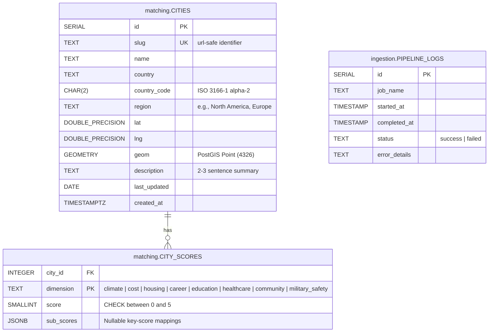

# RelocateWise — Database Design

This document details the database architecture for RelocateWise. Under the project constraints (`docs/Constraints.md`), the database runs on PostgreSQL 16 with PostGIS 3.4 extensions, hosted inside a Docker container on the target Ubuntu environment.

---

## 1. Design Principles

1. **Normalized Dimension Scoring**: Rather than flattening scores as columns on the `cities` table, dimension scores are stored in a separate `city_scores` table (one row per city per dimension). This allows adding new metrics in the future without modifying the table schema or running database migrations.
2. **Zero-PII Footprint**: In compliance with the GDPR-compliant state requirements defined in the PRD, the database stores **only** global city data. No user sessions, questionnaire profiles, shortlists, or lead captures are persisted.
3. **Primary Source Dynamic Updates & Seed Decoupling**: While the database is seeded from a static JSON (`db/seeds/cities.json`) on initial startup, it acts as a dynamic store. An automated ingestion worker periodically updates the scores directly from authoritative primary sources.
4. **Schema Segregation & Service Boundaries**: To support the microservices architecture, the database instance enforces logical schema separation. Each microservice is assigned a dedicated PostgreSQL schema (`matching` and `ingestion`) and a dedicated database role/user with permissions restricted *only* to that schema. Cross-service data access must occur via API interfaces, not cross-schema SQL joins.

---

## 2. Entity Relationship Diagram



---

## 3. Schema DDL Definition

The database schema is partitioned into isolated database schemas, separated by service boundaries.

```sql
-- Enable PostGIS extensions globally
CREATE EXTENSION IF NOT EXISTS postgis;

-- Create service-specific schemas
CREATE SCHEMA IF NOT EXISTS matching;
CREATE SCHEMA IF NOT EXISTS ingestion;

-- ==========================================
-- 3.1 MATCHING SCHEMA (Owned by Matching Service)
-- ==========================================

CREATE TABLE IF NOT EXISTS matching.cities (
  id            SERIAL PRIMARY KEY,
  slug          TEXT UNIQUE NOT NULL,
  name          TEXT NOT NULL,
  country       TEXT NOT NULL,
  country_code  CHAR(2) NOT NULL,
  region        TEXT NOT NULL,
  lat           DOUBLE PRECISION NOT NULL,
  lng           DOUBLE PRECISION NOT NULL,
  geom          GEOMETRY(Point, 4326),
  description   TEXT NOT NULL,
  last_updated  DATE NOT NULL,
  created_at    TIMESTAMPTZ NOT NULL DEFAULT now()
);

CREATE TABLE IF NOT EXISTS matching.city_scores (
  city_id     INTEGER NOT NULL REFERENCES matching.cities(id) ON DELETE CASCADE,
  dimension   TEXT NOT NULL CHECK (dimension IN ('climate', 'cost', 'housing', 'career', 'education', 'healthcare', 'community', 'military_safety')),
  score       SMALLINT NOT NULL CHECK (score BETWEEN 0 AND 5),
  sub_scores  JSONB,
  PRIMARY KEY (city_id, dimension)
);

CREATE INDEX IF NOT EXISTS cities_region_idx          ON matching.cities (region);
CREATE INDEX IF NOT EXISTS cities_country_code_idx   ON matching.cities (country_code);
CREATE INDEX IF NOT EXISTS city_scores_dimension_idx ON matching.city_scores (dimension);

-- ==========================================
-- 3.2 INGESTION SCHEMA (Owned by Ingestion Service)
-- ==========================================

CREATE TABLE IF NOT EXISTS ingestion.pipeline_logs (
  id             SERIAL PRIMARY KEY,
  job_name       TEXT NOT NULL,
  started_at     TIMESTAMPTZ NOT NULL DEFAULT now(),
  completed_at   TIMESTAMPTZ,
  status         TEXT NOT NULL CHECK (status IN ('success', 'failed')),
  error_details  TEXT
);

CREATE INDEX IF NOT EXISTS pipeline_logs_status_idx ON ingestion.pipeline_logs (status);
```

### Table: `matching.cities`
Stores primary metadata and geo-coordinates for each location.
* **`geom` (GEOMETRY)**: A PostGIS geometry column initialized with SRID **4326** (WGS 84 coordinate reference system). Generated automatically during seeding/updates.

### Table: `matching.city_scores`
Stores standardized dimension scores (0–5 rating, where 5 is best/highest rating) and specific sub-score breakdowns.
* **`score`**: Normalized dimension score.
* **`sub_scores`**: A `JSONB` structure designed to store sub-dimensional detail.
  * **Climate sub-scores**: Contains the climate classification label.
    `{ "label": "Mediterranean" }`
  * **Career sub-scores**: Key-value pairs containing 1-5 ratings across major industry clusters (Tech, Finance, Healthcare, Creative, Manufacturing).
  * **Community sub-scores**: Ratings for tags (Urban, Suburban, Coastal, Mountain, Arts/Culture, Family-oriented, Expat-friendly).
  * **Geopolitical and Conflict Risk sub-scores (stored under 'military_safety')**: Contextual details like regional conflict level, travel advisory code, or security indexes.

---

## 4. Seeding and Truncation Operations

The seed pipeline reads JSON definitions inside `db/seeds/cities.json` and loads them into PostgreSQL matching schema on initial startup.

### Seeding Execution
On container boot-up, the **Matching Service** executes:
1. Queries `SELECT COUNT(*)::int AS n FROM matching.cities`.
2. If `n == 0`, it loads the seed data from the JSON file.

### Manual CLI Commands
To reset and re-seed the database locally or in staging:
```bash
uv run npm run db:seed
```
This runs:
```sql
TRUNCATE matching.city_scores, matching.cities RESTART IDENTITY CASCADE;
```

---

## 5. Automated Ingestion Pipeline

To keep city ratings accurate, the **Data Ingestion Service** runs harvesters:
1. **Trigger**: Cron job runs the ingestion script (weekly or monthly).
2. **Fetch**: Fetches statistics from OECD, UN, Wikipedia, Numbeo, and travel advisories.
3. **Normalize**: Processes statistics into 1-5 indices.
4. **Log**: Writes execution details into `ingestion.pipeline_logs`.
5. **Update DB via API**: Processes the update by executing a secure API call to the Matching Service (`PUT /api/internal/cities/:slug/scores`). The Matching Service writes the changes to `matching.city_scores` and updates the `last_updated` date on `matching.cities`. This prevents database schema bypass and guarantees strict data ownership rules.
