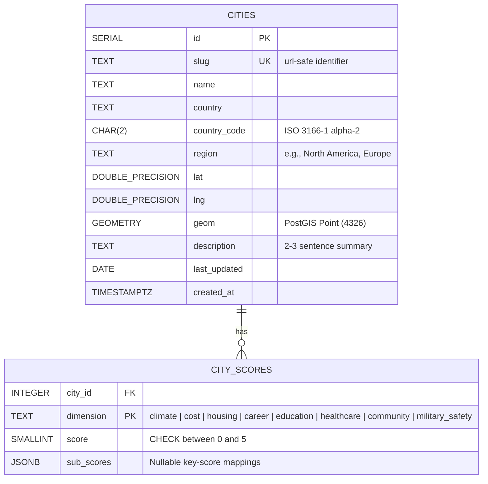

# RelocateWise — Database Design

This document details the database architecture for RelocateWise. Under the project constraints (`docs/Constraints.md`), the database runs on PostgreSQL 16 with PostGIS 3.4 extensions, hosted inside a Docker container on the target Ubuntu environment.

---

## 1. Design Principles

1. **Normalized Dimension Scoring**: Rather than flattening scores as columns on the `cities` table, dimension scores are stored in a separate `city_scores` table (one row per city per dimension). This allows adding new metrics (e.g., "Air Quality" or "Geopolitical and Conflict Risk") in the future without modifying the table schema or running database migrations.
2. **Zero-PII Footprint**: In compliance with the GDPR-compliant state requirements defined in the PRD, the database stores **only** global city data. No user sessions, questionnaire profiles, shortlists, or lead captures are persisted.
3. **Primary Source Dynamic Updates & Seed Decoupling**: While the database is seeded from a static JSON (`db/seeds/cities.json`) on initial startup, it acts as a dynamic store. An automated ingestion worker periodically updates the scores directly from authoritative primary sources.

---

## 2. Entity Relationship Diagram



---

## 3. Schema DDL Definition

The database schema is initialized by the migration script [001_init.sql](file:///Users/victorxu/projects/relocate_wise/db/migrations/001_init.sql).

```sql
-- Enable PostGIS extensions for future geospatial spatial filtering
CREATE EXTENSION IF NOT EXISTS postgis;

CREATE TABLE IF NOT EXISTS cities (
  id            SERIAL PRIMARY KEY,
  slug          TEXT UNIQUE NOT NULL,
  name          TEXT NOT NULL,
  country       TEXT NOT NULL,
  country_code  CHAR(2) NOT NULL,
  region        TEXT NOT NULL,
  lat           DOUBLE PRECISION NOT NULL,
  lng           DOUBLE PRECISION NOT NULL,
  geom          GEOMETRY(Point, 4326),
  description   TEXT NOT NULL,
  last_updated  DATE NOT NULL,
  created_at    TIMESTAMPTZ NOT NULL DEFAULT now()
);

CREATE TABLE IF NOT EXISTS city_scores (
  city_id     INTEGER NOT NULL REFERENCES cities(id) ON DELETE CASCADE,
  dimension   TEXT NOT NULL CHECK (dimension IN ('climate', 'cost', 'housing', 'career', 'education', 'healthcare', 'community', 'military_safety')),
  score       SMALLINT NOT NULL CHECK (score BETWEEN 0 AND 5),
  sub_scores  JSONB,
  PRIMARY KEY (city_id, dimension)
);

-- Indices for performance optimization
CREATE INDEX IF NOT EXISTS cities_region_idx          ON cities (region);
CREATE INDEX IF NOT EXISTS cities_country_code_idx   ON cities (country_code);
CREATE INDEX IF NOT EXISTS city_scores_dimension_idx ON city_scores (dimension);
```

### Table: `cities`

Stores the primary metadata and geo-coordinates for each location.
* **`geom` (GEOMETRY)**: A PostGIS geometry column initialized with SRID **4326** (WGS 84 coordinate reference system). Generated automatically during seeding/updates:
  ```sql
  ST_SetSRID(ST_MakePoint(longitude, latitude), 4326)
  ```

### Table: `city_scores`

Stores the standardized dimension scores (0–5 rating, where 5 is best/highest rating) and specific sub-score breakdowns.
* **`score`**: Normalized dimension score (1-5 range).
* **`sub_scores`**: A `JSONB` structure designed to store sub-dimensional detail.
  * **Climate sub-scores**: Contains the climate classification label.
    `{ "label": "Mediterranean" }`
  * **Career sub-scores**: Key-value pairs containing 1-5 ratings across major industry clusters (Tech, Finance, Healthcare, Creative, Manufacturing).
  * **Community sub-scores**: Ratings for tags (Urban, Suburban, Coastal, Mountain, Arts/Culture, Family-oriented, Expat-friendly).
  * **Geopolitical and Conflict Risk sub-scores (stored under 'military_safety')**: Contextual details like regional conflict level, travel advisory code, or security indexes.
    `{ "conflict_risk": "low", "travel_advisory": "level_1" }`

---

## 4. Seeding and Truncation Operations

The seed pipeline reads the JSON definitions inside `db/seeds/cities.json` and loads them into PostgreSQL on initial database instantiation.

### Seeding Execution

On container boot-up:
1. The API server calls `seedIfEmpty()` within `seed.ts`.
2. It queries `SELECT COUNT(*)::int AS n FROM cities`.
3. If `n == 0`, it loads the seed data from the JSON file into the database.

### Manual CLI Commands

To reset and re-seed the database locally or in staging:

```bash
uv run npm run db:seed
```

This runs:
```sql
TRUNCATE city_scores, cities RESTART IDENTITY CASCADE;
```

---

## 5. Automated Ingestion Pipeline

To keep city ratings accurate, an automated background job pulls directly from raw primary sources.

### Ingestion Flow
1. **Trigger**: Node-Cron runs the ingestion job on a weekly or monthly schedule.
2. **Fetch**: The worker fetches raw statistics from sources like:
   - **OECD Portal**: Housing affordability, local employment indices.
   - **UN Open Data**: Healthcare access metrics, education levels.
   - **Wikipedia**: Climate normals, location demographics.
   - **Numbeo**: Living cost indicators.
   - **Geopolitical Feeds / Security advisories**: Geopolitical safety rating, military/conflict risks.
3. **Parse & Normalize**: Cleans, parses, and maps the raw values into standard 1–5 indices.
4. **Update DB**: Performs a transaction writing the updated scores to `city_scores` using:
   ```sql
   INSERT INTO city_scores (city_id, dimension, score, sub_scores)
   VALUES ($1, $2, $3, $4)
   ON CONFLICT (city_id, dimension) 
   DO UPDATE SET score = EXCLUDED.score, sub_scores = EXCLUDED.sub_scores;
   ```
5. **Timestamp Update**: Updates `last_updated` on the matching row in `cities` to the current date.
