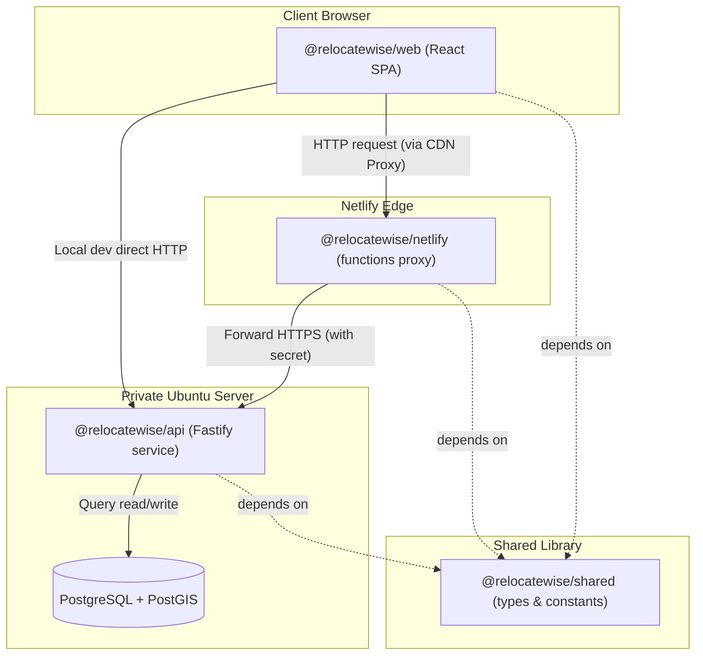

# RelocateWise — Module Map

This document describes the workspace boundary mapping and dependency layout of the RelocateWise monorepo. The codebase is organized into four distinct NPM workspace packages located under the root project directory.

---

## 1. Monorepo Architecture Overview

---

## 2. Workspace Package Details

### 2.1 Shared Library (`@relocatewise/shared`)
- **Purpose**: Provides type definitions and climate categorization constants used across the frontend, Netlify edge functions, and backend API. It has zero runtime npm dependencies.
- **Location**: `/shared`
- **Package Dependencies**:
  - `typescript` (devDependency only)
- **Public Interfaces (Exports)**:
  - `.`: Resolves to `types.ts` containing:
    - User/Form: `UserProfile`, `ClimatePreference`, `Industry`, `EducationPriority`, `LifestyleTag`, `Importance`
    - City Model: `City`, `CityDimensions`, `CityClimateSub`, `CityCareerSub`, `CityCommunitySub`
    - API Payloads: `MatchResult`, `MatchedCity`, `MatchResponse`, `ApiError`
  - `./climate`: Resolves to `climate.ts` containing:
    - `CLIMATE_GROUPS`: Maps user climate preferences (e.g. `temperate`, `mediterranean`) to arrays of compatible city climate labels (e.g. `Temperate`, `Highland`, `Mediterranean`) used in matching scoring.
- **Future Extension Points**:
  - Adding schemas for newer dimensions (e.g., crime rate index, transit metrics).
  - Centralizing schema validation schemas if shared client-side.

---

### 2.2 Frontend SPA (`@relocatewise/web`)
- **Purpose**: Interactive client React single-page application. Serves the landing page, rendering form quiz steps, persisting shortlisted cities in browser session state, displaying side-by-side matches, and rendering cookie consent.
- **Location**: `/web`
- **Package Dependencies**:
  - `@relocatewise/shared` (Workspace dependency)
  - `react`, `react-dom` (UI library)
  - `react-router-dom` (Routing engine)
  - `vite` (Build compiler and hot reloader)
- **Public Interfaces**:
  - Compiles to static assets under `/web/dist`, served globally via CDN.
  - Consumes `/api/match` and `/api/cities/:slug` endpoints.
- **Future Extension Points**:
  - Adding Leaflet or Mapbox mapping utilities for visual city coordinates selection.
  - Implementing user account gates and Stripe portal checkouts.

---

### 2.3 Backend API (`@relocatewise/api`)
- **Purpose**: Core application business logic, hosting the REST endpoints, validating request payloads with Zod, executing the deterministic matching algorithm, connecting to the PostgreSQL container, and running database migrations and seeding.
- **Location**: `/api`
- **Package Dependencies**:
  - `@relocatewise/shared` (Workspace dependency)
  - `fastify` (Web server framework)
  - `@fastify/cors` (Cross-origin middleware)
  - `pg` (Postgres driver client)
  - `zod` (Data parsing and validation)
- **Public Interfaces**:
  - HTTP Listener (Port 3000 by default):
    - `GET /api/health`
    - `GET /api/cities`
    - `GET /api/cities/:slug`
    - `POST /api/match`
- **Future Extension Points**:
  - Adding user authentication middlewares.
  - Creating API controllers for writing data (e.g., custom user feedback, saved comparison lists).
  - Leveraging PostGIS geometry indexes to execute query filters like `ST_DWithin` for proximity-based ranking.

---

### 2.4 Netlify Functions Proxy (`@relocatewise/netlify`)
- **Purpose**: Pass-through API proxy running on Netlify edge functions. Solves CORS issues for the browser, rate-limits abuse requests, injects the backend API token secret, and applies a 60s in-memory cache on GET city requests.
- **Location**: `/netlify`
- **Package Dependencies**:
  - `@netlify/functions` (Netlify function runtime)
- **Public Interfaces**:
  - Default route handler proxying `/api/*` to the remote API host endpoint.
- **Future Extension Points**:
  - Hooking up Edge Middleware for custom geography detection or header modification.
  - Multi-variant A/B testing page redirects.

---

## 3. Boundary Rules & Communication

1. **State Isolation**: The backend server is stateless. Client sessions (such as the shortlist comparisons) must reside purely in the user's browser context (`sessionStorage` or React State).
2. **Coupling Prevention**: Frontend (`@relocatewise/web`) and Edge (`@relocatewise/netlify`) never communicate directly with the database. All CRUD operations must pass through `@relocatewise/api` REST contracts.
3. **Data Integrity**: Contract changes (types and constants) must always be modified in `@relocatewise/shared` first, ensuring consistency between client payloads and server schemas.
