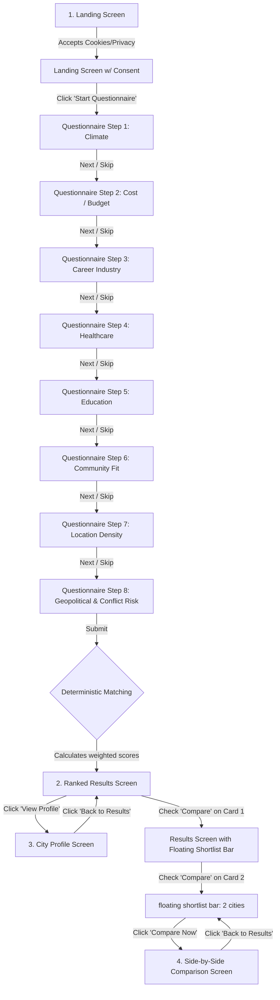

# RelocateWise — User Flows Specification

This document maps out the user journeys, entry points, navigation paths, decision points, success outcomes, and alternative/error flows for the RelocateWise MVP.

---

## 1. User Goals & Entry Points

### User Goals
*   **Discover Matches**: Complete a questionnaire to find cities that match their lifestyle, career, climate, and budget preferences.
*   **Analyze City Profiles**: Dive into individual city details to understand quantitative ratings and qualitative summaries.
*   **Compare Candidates**: Select 2 or 3 cities and compare their metrics side-by-side to understand trade-offs.
*   **Understand Match Quality**: See a clear, deterministic explanation of why each city matched their preferences.
*   **Toggle Language Dynamically**: Switch the entire application interface between English and Chinese (Simplified) on any screen without losing current state.

### Entry Points
*   **Direct Traffic / Search Engines**: Users land on the homepage/landing screen.
*   **Deep Links**: Users land directly on a specific city profile page (e.g., from an organic search or external link).

---

## 2. Primary Navigation Path (Success Flow)

### Detailed Steps

#### Step 1: Landing & Privacy Consent
*   **Action**: User arrives at the homepage.
*   **Decision Point**: A cookie consent banner is presented.
    *   *Path A (Consent)*: User clicks "Accept". Non-essential cookies/analytics are initialized. Banner disappears.
    *   *Path B (Decline)*: User clicks "Decline" or closes the banner. No non-essential cookies are set.
*   **Language Selection**: User can toggle the manual language selector (`EN` / `ZH`) in the global header to switch between English and Chinese (Simplified) dynamically.
*   **Navigation**: User clicks the primary Call to Action (CTA) "Start Questionnaire" to move to Step 2.

#### Step 2: Questionnaire Progression
*   **Action**: User answers a sequence of 8 core preference questions:
    1.  **Climate Preference** (e.g., Mediterranean, Continental, Tropical).
    2.  **Housing Budget Range** (Relative index 1–5).
    3.  **Career & Industry Focus** (e.g., Tech, Finance, Healthcare, Creative, Manufacturing).
    4.  **Healthcare Quality Priority** (Importance rating 1–5).
    5.  **Education Quality Priority** (Importance rating 1–5, with a "Not Applicable" option for households without children).
    6.  **Community & Lifestyle Fit** (e.g., Urban, Suburban, Coastal, Mountain, Arts/Culture).
    7.  **Location Density Preference** (Urban, Suburban, Rural).
    8.  **Geopolitical & Conflict Risk Priority** (Importance rating 1–5).
*   **Controls on Each Screen**:
    *   *Next / Select Option*: Progresses to the next step.
    *   *Back*: Returns to the previous step (retaining the selected option).
    *   *Skip*: Progresses to the next step using a documented default weight for that dimension.
*   **Completion**: At the final question, the user clicks "View Matches". This triggers the deterministic matching engine on the local PostgreSQL backend.

#### Step 3: Ranked Results View
*   **Action**: User views the top 10 matching cities.
*   **Information Displayed**: City name, country, overall match score (0–100), and a structured "Why this fits you" sentence summarizing the highest-matching dimensions.
*   **Decision Point**:
    *   *Option A*: Click "View Profile" on a city card to inspect that city.
    *   *Option B*: Check the "Compare" checkbox (adds the city to the session shortlist).
    *   *Option C*: Click "Start Over" to reset all answers and return to Step 2.

#### Step 4: City Profile Inspection
*   **Action**: User reads the 8 normalized indices (1–5) and qualitative summary for a chosen city.
*   **Decision Point**:
    *   *Option A*: Click "Add to Comparison" (if shortlist < 3).
    *   *Option B*: Click "Remove from Comparison" (if already in shortlist).
    *   *Option C*: Click "Back to Results" to return to the results list.
    *   *Option D*: Click "Compare" (if shortlist has >= 2 cities) to navigate to the comparison matrix.

#### Step 5: Side-by-Side Comparison
*   **Action**: User compares 2 or 3 shortlisted cities in a matrix (one row per dimension, with the best-matching city highlighted).
*   **Decision Point**:
    *   *Option A*: Click "Remove" on a city column header to drop it from comparison.
    *   *Option B*: Click "Clear All" to empty the shortlist and return to results.
    *   *Option C*: Click "Back to Results" to return with the shortlist intact.

---

## 3. Success Outcomes

1.  **Match Discovery**: The user finishes the questionnaire and receives exactly 10 relevant matches representing diverse geographies.
2.  **Shortlist Construction**: The user identifies 2–3 target cities and adds them to their session shortlist.
3.  **Trade-off Resolution**: The user views the Side-by-Side Comparison screen, identifies the top-scoring city for each of their prioritized dimensions, and gains decision confidence.

---

## 4. Alternate & Error Flows

### A. Skipped Question Flow
*   **Scenario**: User clicks "Skip" on a question during the questionnaire.
*   **Behavior**: The UI advances to the next step. The matching engine utilizes a neutral default value (neutral weight of 0 or average score matching) for the skipped category.
*   **Outcome**: The matching calculations complete successfully without blocking the user.

### B. Shortlist Overflow (Adding a 4th City)
*   **Scenario**: User has 3 cities in the shortlist and attempts to check a 4th "Compare" checkbox.
*   **UI Behavior**:
    1.  The checkbox action is intercepted.
    2.  A transient, non-blocking toast notification/alert is displayed: *"Comparison limit reached. You can compare up to 3 cities. Please remove an existing city to add a new one."*
    3.  The 4th checkbox remains unchecked.
*   **Outcome**: User is prevented from adding the 4th city, protecting the layout from overflow.

### C. Compare View with Insufficient Cities
*   **Scenario**: User navigates directly to `/compare` (or tries to trigger comparison) with less than 2 cities selected.
*   **UI Behavior**:
    1.  The primary "Compare" button on the Results/Shortlist bar is disabled unless shortlist count >= 2.
    2.  If the user bypasses this via direct URL entry, they are redirected to the Results page, and a notice is displayed: *"Please select at least 2 cities to compare."*
*   **Outcome**: Layout integrity is maintained.

### D. Zero-Result State (Database Connectivity or Empty Match Fallback)
*   **Scenario**: The backend returns an error or an empty list (highly unlikely since matching is deterministic over a static seed dataset, but possible under network/database failure).
*   **UI Behavior**:
    1.  The results page displays a clean error/empty state illustration.
    2.  A friendly message is displayed: *"We couldn't generate matches right now. Please try again or reset the quiz."*
    3.  A primary CTA button "Retry Match" or "Start Over" is provided.
*   **Outcome**: User is given a clear path to recover from data anomalies.

### E. Session Reset / Browser Close
*   **Scenario**: User closes the browser tab or submits a brand new questionnaire.
*   **Behavior**: Browser session storage is cleared. The shortlist is reset to empty.
*   **Outcome**: User privacy is respected; no persistent footprint remains.

### F. Dynamic Language Selection
*   **Scenario**: User toggles language (e.g. from EN to ZH) midway through the questionnaire, on results, or on a city profile.
*   **Behavior**:
    1. UI immediately shifts all static text and components into the selected language translations.
    2. Any session state (shortlisted cities, currently answered questions in the wizard) is preserved exactly as is.
    3. The application does not refresh or lose page history.
*   **Outcome**: Seamless multilingual user experience with zero state loss.
